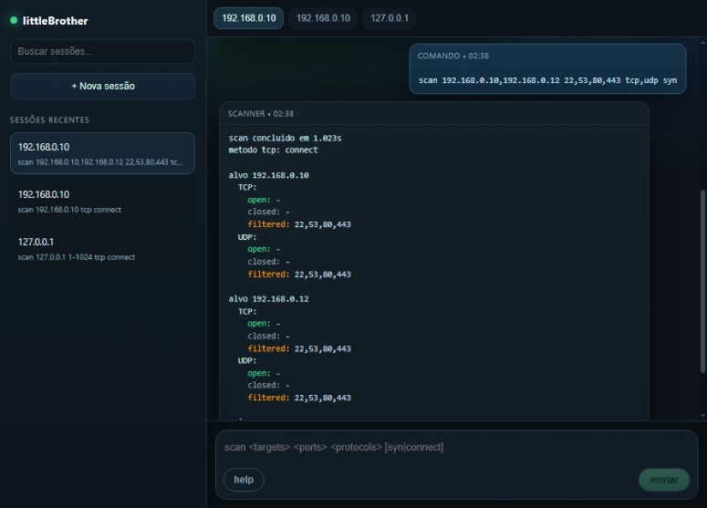

<div align="center">
   <h2 align="center">littleBrother</h2>
   <p align="center">
      Ferramenta com interface para varredura de portas TCP e UDP, voltada para testes em rede local.
   </p>
</div>

<div align="center">
   <a href="https://www.python.org/">
      
   </a>
   <a href="https://flask.palletsprojects.com/">
      
   </a>
   <a href="https://scapy.readthedocs.io/">
      
   </a>
   <a href="https://www.linux.org/">
      
   </a>
</div>

<br>

<div align="center">
   <a href="#sobre-o-projeto">Sobre</a> &#xa0; • &#xa0;
   <a href="#instalação">Instalação</a> &#xa0; • &#xa0;
   <a href="#uso">Uso</a> &#xa0; • &#xa0;
   <a href="#endpoints">Endpoints</a> &#xa0; • &#xa0;
   <a href="#licença">Licença</a> &#xa0; • &#xa0;
   <a href="#autor">Autor</a>
</div>

----

<div align="center">
  <p>
    
  </p>
</div>

## Sobre o projeto

O **littleBrother** é uma pequena aplicação web para varredura de portas TCP e UDP, com backend em **Flask** e interface em **HTML/CSS/JavaScript**.

A ferramenta foi pensada para operar **em Linux**. Em Windows e macOS, o funcionamento é possível em partes, mas o comportamento pode variar por limitações de privilégio, firewall e suporte a pacotes de rede. É recomendável uma **VM com o Kali Linux**.

### Funcionalidades

- **Varredura TCP e UDP** em um ou mais endereços IP.
- **Método TCP simples** com fallback para `connect scan` e tentativa de `SYN scan` quando disponível em Linux com privilégios elevados.
- **Classificação de portas** como `open`, `closed` e `filtered`.

### Tecnologias utilizadas

<a href="https://www.python.org/">
   
</a>
<a href="https://flask.palletsprojects.com/">
   
</a>
<a href="https://scapy.readthedocs.io/">
   
</a>

<div align="left">
   <h6><a href="#littlebrother"> Voltar para o início ↺</a></h6>
</div>

## Instalação

### Pré-requisitos

> [!IMPORTANT]
> Para rodar a aplicação, você deve ter:
>
> - **Python 3.10+**
> - **Linux recomendado** para melhor suporte ao modo SYN
> - **pip** para instalar dependências
> - **Scapy** para a parte de varredura de rede

### Iniciando o projeto

1. Clone o repositório

```bash
git clone <URL_DO_REPOSITORIO>
cd littleBrother
```

2. Instale as dependências obrigatórias

```bash
pip install -r requirements.txt
```

3. Inicie o servidor Flask

```bash
python start.py
```

4. Abra a interface no navegador

```text
http://localhost:5000
```

> [!NOTE]
> O backend expõe a interface web em `/` e a API de varredura em `/api/scan`.
> Em Linux, o `SYN scan` pode ser usado quando o processo tiver privilégios suficientes.

<div align="left">
   <h6><a href="#littlebrother"> Voltar para o início ↺</a></h6>
</div>

## Uso

### Comandos da interface

Na barra de comando da aplicação, você pode usar os seguintes formatos:

```text
help
scan <targets> <ports> <protocols> [syn|connect]
scan <targets> <protocols> [syn|connect]
```

### Exemplos

```text
scan 127.0.0.1 22,80 tcp connect
scan 127.0.0.1 tcp connect
scan 192.168.0.10,192.168.0.11 1-1024 tcp,udp syn
```

### O que o retorno mostra

- **open**: porta aberta.
- **closed**: porta fechada.
- **filtered**: porta filtrada ou sem resposta conclusiva.

### Observações por sistema operacional

- **Linux**: melhor cenário para o projeto, especialmente para `SYN scan`.
- **Windows**: o scanner funciona, mas o resultado tende a depender mais de firewall e permissões.
- **macOS**: pode funcionar, mas o comportamento também pode variar por restrições do sistema.

<div align="left">
   <h6><a href="#littlebrother"> Voltar para o início ↺</a></h6>
</div>

## Endpoints

A aplicação expõe endpoints JSON no backend Flask. Eles são consumidos pela interface web via `fetch`.

### `GET /api/info`

Retorna informações do ambiente detectado pelo backend.

**Resposta exemplo:**

```json
{
  "ok": true,
  "environment": {
    "platform": "linux",
    "platform_name": "Linux",
    "is_linux": true,
    "is_windows": false,
    "scapy_available": true,
    "syn_scan_available": true,
    "notes": []
  }
}
```

### `POST /api/scan`

Executa a varredura.

Esse endpoint devolve um objeto JSON com o resumo da execução, o detalhamento por alvo e possíveis avisos de ambiente.

**Corpo da requisição:**

```json
{
  "targets": "127.0.0.1,192.168.0.10",
  "ports": "22,80,443,1-1024",
  "protocols": "tcp,udp",
  "tcp_method": "connect",
  "timeout": 1.0,
  "workers": 200
}
```

**Resposta simplificada:**

```json
{
  "ok": true,
  "scan": {
    "targets": ["127.0.0.1"],
    "ports": [22, 80, 443],
    "protocols": ["tcp"],
    "tcp_method": "connect",
    "duration_seconds": 0.123
  },
  "summary": {
    "tcp": { "open": 1, "closed": 2, "filtered": 0 },
    "udp": { "open": 0, "closed": 0, "filtered": 0 }
  },
  "results": {
    "127.0.0.1": {
      "tcp": [
        { "port": 22, "status": "open" }
      ],
      "udp": []
    }
  },
  "warnings": []
}
```

<div align="left">
   <h6><a href="#littlebrother"> Voltar para o início ↺</a></h6>
</div>

## Licença

Este projeto está licenciado sob a licença MIT. Veja o arquivo [LICENSE](https://github.com/juletopi/littleBrother/blob/master/LICENSE) para mais detalhes.

<div align="left">
   <h6><a href="#littlebrother"> Voltar para o início ↺</a></h6>
</div>

## Autor

<table>
  <tr>
    <td valign="middle" width="25%">
      <div align="center">  
        <a href="https://github.com/juletopi" title="Perfil no GitHub" aria-label="GitHub - Juletopi">
          
          <br>
          <sub><strong>Júlio Cézar | Juletopi</strong></sub>
          <br>
        </a>
      </div>
    </td>
    <td valign="middle" width="75%">
      <ul style="list-style: none; padding-left: 0; margin: 0;">
        <li>
          
          LinkedIn — 
          <a href="https://www.linkedin.com/in/julio-cezar-pereira-camargo/" target="_blank" rel="noopener noreferrer" aria-label="LinkedIn - Júlio Cézar P. Camargo">
            Júlio Cézar P. Camargo
          </a>
        </li>
        <li>
          
          Email — 
          <a href="mailto:juliocezarpvh@hotmail.com" aria-label="Send email - juliocezarpvh@hotmail.com">
            juliocezarpvh@hotmail.com
          </a>
        </li>
        <li>
          
          Facebook — 
          <a href="https://www.facebook.com/juhletopi" target="_blank" rel="noopener noreferrer" aria-label="Facebook - Juhletopi">
            facebook.com/juhletopi
          </a>
        </li>
        <li>
          
          Instagram — 
          <a href="https://www.instagram.com/juletopi/" target="_blank" rel="noopener noreferrer" aria-label="Instagram - Juletopi">
            @juletopi
          </a>
        </li>
      </ul>
    </td>
  </tr>
  <tr>
    <td colspan="2" align="center">
      
      Portfolio —
      <a href="https://juletopi.github.io/JCPC_Portfolio/" target="_blank" rel="noopener noreferrer" aria-label="Portfolio - Juletopi">
        juletopi.github.io/JCPC_Portfolio
      </a>
    </td>
  </tr>
</table>

<div align="left">
  <h6><a href="#littlebrother"> Voltar para o início ↺</a></h6>
</div>

<br>

----

<div align="center">
  Feito com ❤️ e ☕ por <a href="https://github.com/juletopi">Juletopi</a>.
</div>
