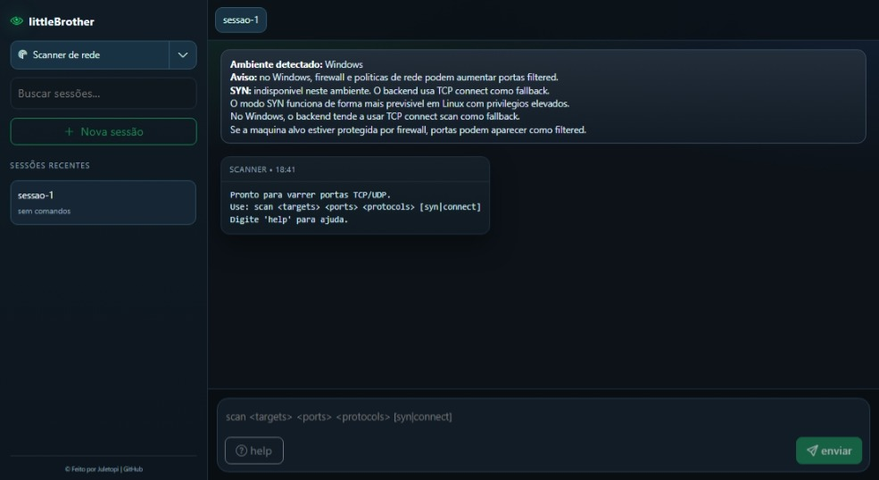
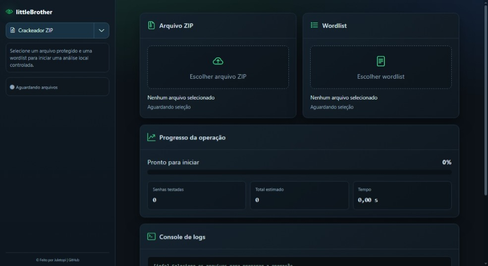

<div align="center">
   <a href="">
    
   </a>
   <h2 align="center">littleBrother</h2>
   <p align="center">
      Plataforma web modular para análise de redes e recuperação de arquivos ZIP. Use com responsabilidade.
   </p>
</div>

<div align="center">
   <a href="https://www.python.org/">
      
   </a>
   <a href="https://flask.palletsprojects.com/">
      
   </a>
   <a href="https://scapy.readthedocs.io/">
      
   </a>
   <a href="https://www.linux.org/">
      
   </a>
</div>

<br>

<div align="center">
   <a href="#sobre-o-projeto">Sobre</a> &#xa0; • &#xa0;
   <a href="#instalação">Instalação</a> &#xa0; • &#xa0;
   <a href="#uso">Uso</a> &#xa0; • &#xa0;
   <a href="#licença">Licença</a> &#xa0; • &#xa0;
   <a href="#autor">Autor</a>
</div>

----

## Sobre o projeto

O **littleBrother** é uma aplicação web modular para atividades locais de análise técnica, com backend em **Flask** e interface em **HTML/CSS/JavaScript**. A aplicação reúne ferramentas independentes em uma navegação comum, atualmente com scanner de rede e recuperação de senhas de arquivos ZIP.

O uso deve ocorrer somente em redes, arquivos e sistemas para os quais você tenha autorização. O scanner foi pensado para operar melhor em **Linux**; em Windows e macOS, o funcionamento pode variar por limitações de privilégio, firewall e suporte a pacotes de rede. Uma **VM com Kali Linux** continua sendo recomendada.

### Funcionalidades

- **Menu modular** com navegação compartilhada entre as funcionalidades.
- **Varredura TCP e UDP** em um ou mais endereços IP.
  - **Método TCP simples** com fallback para `connect scan` e tentativa de `SYN scan` quando disponível em Linux com privilégios elevados.
  - **Classificação de portas** como `open`, `closed` e `filtered`.
- **Recuperação de senhas ZIP** por wordlist, com suporte a ZipCrypto e AES via `pyzipper` ou 7-Zip.
  - **Acompanhamento assíncrono** do ZIP com progresso, logs, tempo decorrido e cancelamento.

### Tecnologias utilizadas

<a href="https://www.python.org/">
   
</a>
<a href="https://flask.palletsprojects.com/">
   
</a>
<a href="https://scapy.readthedocs.io/">
   
</a>
<a href="https://pypi.org/project/pyzipper/">
  
</a>

<div align="left">
   <h6><a href="#littlebrother"> Voltar para o início ↺</a></h6>
</div>

## Instalação

### Pré-requisitos

> [!IMPORTANT]
> Para rodar a aplicação, você deve ter:
>
> - **Python 3.10+**
> - **Linux recomendado** para melhor suporte ao modo SYN
> - **pip** para instalar dependências
> - **Flask** para o backend web
> - **Scapy** para a parte de varredura de rede
> - **pyzipper** para arquivos ZIP com criptografia AES
> - **7-Zip opcional** para suporte externo a arquivos ZIP AES

### Iniciando o projeto

1. Clone o repositório

```bash
git clone <URL_DO_REPOSITORIO>
cd littleBrother
```

2. Instale as dependências obrigatórias

```bash
pip install -r requirements.txt
```

3. Inicie o servidor Flask

```bash
python start.py
```

4. Abra a interface no navegador

```text
http://localhost:5000
```

> [!NOTE]
> O backend expõe o menu em `/`, o scanner em `/scanner`, o crackeador em `/zip-cracker`, a API de varredura em `/api/scan` e a API de ZIP em `/api/crack`.
> Em Linux, o `SYN scan` pode ser usado quando o processo tiver privilégios suficientes.

<div align="left">
   <h6><a href="#littlebrother"> Voltar para o início ↺</a></h6>
</div>

## Uso

<div align="center">
  <p>
    
  </p>
</div>

### Scanner de rede

#### Comandos da interface

Na barra de comando da aplicação, você pode usar os seguintes formatos:

```text
help
scan <targets> <ports> <protocols> [syn|connect]
scan <targets> <protocols> [syn|connect]
```

#### Exemplos

```text
scan 127.0.0.1 22,80 tcp connect
scan 127.0.0.1 tcp connect
scan 192.168.0.10,192.168.0.11 1-1024 tcp,udp syn
```

#### O que o retorno mostra

- **open**: porta aberta.
- **closed**: porta fechada.
- **filtered**: porta filtrada ou sem resposta conclusiva.

#### Observações por sistema operacional

- **Linux**: melhor cenário para o projeto, especialmente para `SYN scan`.
- **Windows**: o scanner funciona, mas o resultado tende a depender mais de firewall e permissões.
- **macOS**: pode funcionar, mas o comportamento também pode variar por restrições do sistema.

<div align="center">
  <a href="#">
    
  </a>
</div>

<br>

<div align="center">
  <p>
    
  </p>
</div>

### Recuperação de ZIP

#### Como recuperar senhas de arquivos ZIP

1. Selecione um arquivo `.zip` protegido.
2. Selecione uma wordlist com uma senha por linha.
3. Clique em **Iniciar análise**.
4. Acompanhe o progresso, os logs e o tempo da operação.

O processamento ocorre em uma thread separada. Os arquivos enviados são temporários e removidos ao final da sessão. Use este módulo somente com arquivos próprios ou com autorização explícita.

Para ZIPs AES, o serviço usa 7-Zip quando encontrado no sistema e `pyzipper` como fallback Python. Sem nenhuma dessas opções, a recuperação de arquivos AES não estará disponível.

<div align="left">
   <h6><a href="#littlebrother"> Voltar para o início ↺</a></h6>
</div>

## Licença

Este projeto está licenciado sob a licença MIT. Veja o arquivo [LICENSE](https://github.com/juletopi/littleBrother/blob/main/LICENSE) para mais detalhes.

<div align="left">
   <h6><a href="#littlebrother"> Voltar para o início ↺</a></h6>
</div>

## Autor

<table>
  <tr>
    <td valign="middle" width="25%">
      <div align="center">  
        <a href="https://github.com/juletopi" title="Perfil no GitHub" aria-label="GitHub - Juletopi">
          
          <br>
          <sub><strong>Júlio Cézar | Juletopi</strong></sub>
          <br>
        </a>
      </div>
    </td>
    <td valign="middle" width="75%">
      <ul style="list-style: none; padding-left: 0; margin: 0;">
        <li>
          
          LinkedIn — 
          <a href="https://www.linkedin.com/in/julio-cezar-pereira-camargo/" target="_blank" rel="noopener noreferrer" aria-label="LinkedIn - Júlio Cézar P. Camargo">
            Júlio Cézar P. Camargo
          </a>
        </li>
        <li>
          
          Email — 
          <a href="mailto:juliocezarpvh@hotmail.com" aria-label="Send email - juliocezarpvh@hotmail.com">
            juliocezarpvh@hotmail.com
          </a>
        </li>
        <li>
          
          Facebook — 
          <a href="https://www.facebook.com/juhletopi" target="_blank" rel="noopener noreferrer" aria-label="Facebook - Juhletopi">
            facebook.com/juhletopi
          </a>
        </li>
        <li>
          
          Instagram — 
          <a href="https://www.instagram.com/juletopi/" target="_blank" rel="noopener noreferrer" aria-label="Instagram - Juletopi">
            @juletopi
          </a>
        </li>
      </ul>
    </td>
  </tr>
  <tr>
    <td colspan="2" align="center">
      
      Portfolio —
      <a href="https://juletopi.github.io/JCPC_Portfolio/" target="_blank" rel="noopener noreferrer" aria-label="Portfolio - Juletopi">
        juletopi.github.io/JCPC_Portfolio
      </a>
    </td>
  </tr>
</table>

<div align="left">
  <h6><a href="#littlebrother"> Voltar para o início ↺</a></h6>
</div>

<br>

----

<div align="center">
  Feito com ❤️ e ☕ por <a href="https://github.com/juletopi">Juletopi</a>.
</div>
